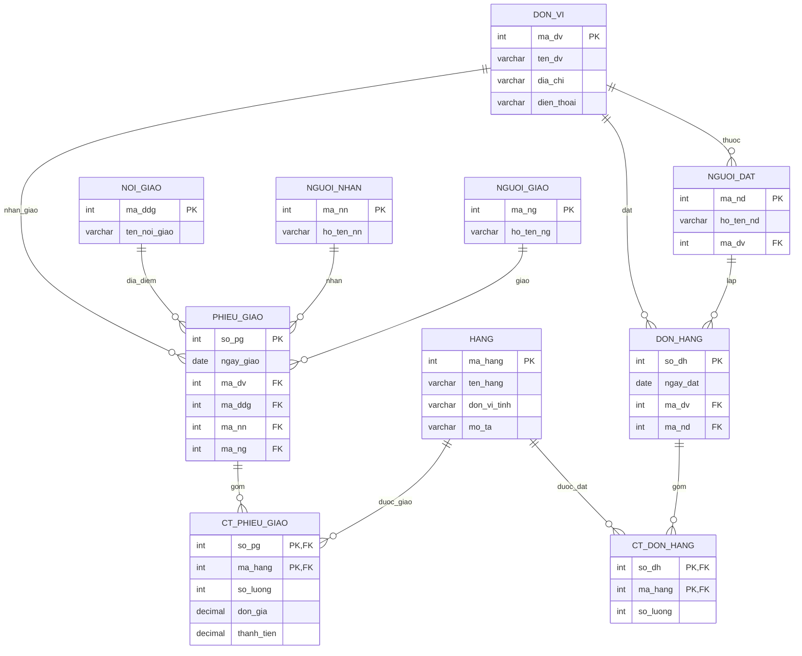

# ERD - Quản lý đơn đặt hàng

```mermaid
erDiagram
    DON_VI ||--o{ NGUOI_DAT : "thuoc"
    DON_VI ||--o{ DON_HANG : "dat"
    NGUOI_DAT ||--o{ DON_HANG : "lap"
    DON_HANG ||--o{ CT_DON_HANG : "gom"
    HANG ||--o{ CT_DON_HANG : "duoc_dat"
    DON_VI ||--o{ PHIEU_GIAO : "nhan_giao"
    NOI_GIAO ||--o{ PHIEU_GIAO : "dia_diem"
    NGUOI_NHAN ||--o{ PHIEU_GIAO : "nhan"
    NGUOI_GIAO ||--o{ PHIEU_GIAO : "giao"
    PHIEU_GIAO ||--o{ CT_PHIEU_GIAO : "gom"
    HANG ||--o{ CT_PHIEU_GIAO : "duoc_giao"

    DON_VI {
        int ma_dv PK
        varchar ten_dv
        varchar dia_chi
        varchar dien_thoai
    }
    NGUOI_DAT {
        int ma_nd PK
        varchar ho_ten_nd
        int ma_dv FK
    }
    DON_HANG {
        int so_dh PK
        date ngay_dat
        int ma_dv FK
        int ma_nd FK
    }
    CT_DON_HANG {
        int so_dh PK, FK
        int ma_hang PK, FK
        int so_luong
    }
    HANG {
        int ma_hang PK
        varchar ten_hang
        varchar don_vi_tinh
        varchar mo_ta
    }
    PHIEU_GIAO {
        int so_pg PK
        date ngay_giao
        int ma_dv FK
        int ma_ddg FK
        int ma_nn FK
        int ma_ng FK
    }
    CT_PHIEU_GIAO {
        int so_pg PK, FK
        int ma_hang PK, FK
        int so_luong
        decimal don_gia
        decimal thanh_tien
    }
    NOI_GIAO {
        int ma_ddg PK
        varchar ten_noi_giao
    }
    NGUOI_NHAN {
        int ma_nn PK
        varchar ho_ten_nn
    }
    NGUOI_GIAO {
        int ma_ng PK
        varchar ho_ten_ng
    }
```

PK là khóa chính, FK là khóa ngoại. Các bảng chi tiết dùng khóa chính ghép.
